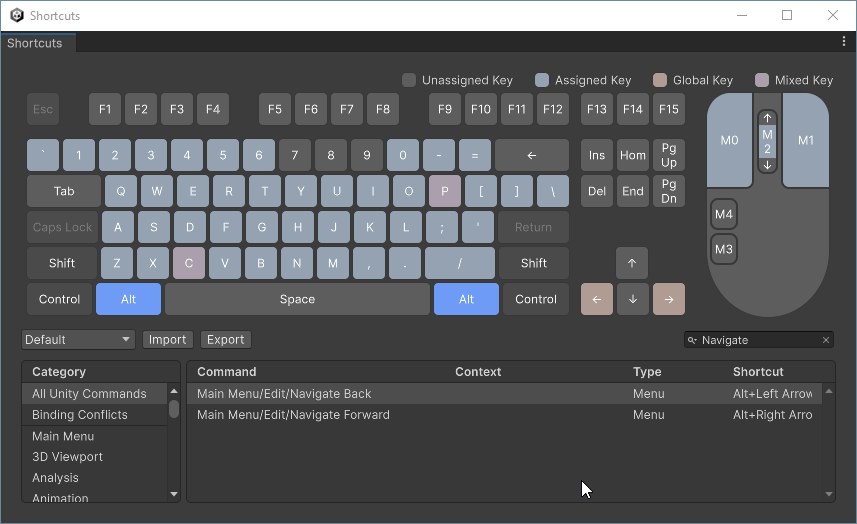

# Navigate Back

## Overview

Navigate back and forward in editor's selection history the same way you do in your IDE.

Just import it into your project and... that's all, zero-config.

## Usage (in Unity 6000.0 and newer versions)

* `Edit > Navigate Back` (<kbd>ALT</kbd> + <kbd>LEFT ARROW</kbd>)
* `Edit > Navigate Forward` (<kbd>ALT</kbd> + <kbd>RIGHT ARROW</kbd>)

## Usage (in previous versions)

* `Edit > Navigate Back` (<kbd>CTRL</kbd> + <kbd>ALT</kbd> + <kbd>LEFT ARROW</kbd>)
* `Edit > Navigate Forward` (<kbd>CTRL</kbd> + <kbd>ALT</kbd> + <kbd>RIGHT ARROW</kbd>)

## Customize

By default, shortcuts are set to <kbd>ALT</kbd> + <kbd>LEFT ARROW</kbd> to **navigate back** and to <kbd>ALT</kbd> + <kbd>RIGHT ARROW</kbd> to **navigate forward**, providing the same default behaviour as **VSCode**, **Rider** or many other **IDE**s.  
Although in **MS Visual Studio**, those are set to <kbd>CTRL</kbd> + <kbd>-</kbd> and <kbd>CTRL</kbd> + <kbd>SHIFT</kbd> + <kbd>-</kbd> respectively.  

In order to change those for the ones you're used to, just use the Editor's built-in shortcuts window under the `Edit > Shortcuts...` menu.

